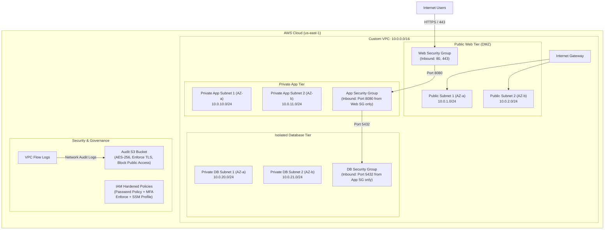

# 🛡️ Automated Secure Cloud Infrastructure & CIS Security Compliance on AWS

[](https://www.terraform.io/)
[](https://learn.microsoft.com/powershell/)
[](https://aws.amazon.com/)
[](#-cis-aws-foundations-benchmark-matrix)

A production-grade, compliance-driven AWS cloud infrastructure provisioned via **Infrastructure as Code (Terraform)** and automated using **PowerShell & AWS CLI**. Designed to adhere to the **CIS AWS Foundations Benchmark** and AWS Well-Architected Security Pillar.

---

## 📌 Architecture Overview



---

## 🔒 CIS AWS Foundations Benchmark Matrix

| CIS Control ID | Security Control | Implementation Details |
| :--- | :--- | :--- |
| **CIS 1.5 - 1.11** | **IAM Password Policy** | Minimum 14 characters, requires uppercase, lowercase, numbers, symbols, 90-day expiry, and history reuse prevention. |
| **CIS 1.16** | **MFA Access Control** | Policy created to deny AWS service access without active Multi-Factor Authentication. |
| **CIS 2.1.1 - 2.1.4** | **S3 Public Access Block** | Enabled all 4 S3 Block Public Access configurations at bucket level. |
| **CIS 2.1.5** | **S3 Data-at-Rest Encryption** | Enforced default Server-Side Encryption (`AES256`). |
| **CIS 2.1.6** | **S3 In-Transit Encryption** | Bucket policy strictly denies non-HTTPS requests (`aws:SecureTransport: false`). |
| **CIS 3.9** | **VPC Flow Logging** | Enabled VPC Flow Logs capturing all accepted and rejected traffic to the audit S3 bucket. |
| **CIS 4.1 & 4.2** | **Security Group Port Restrictions** | Zero open-to-world (`0.0.0.0/0`) ingress on Port 22 (SSH) and Port 3389 (RDP). |
| **CIS 4.3** | **Default Security Group Hardening** | Removed all inbound and outbound rules from default VPC security group. |

---

## 📁 Repository Structure

```text
├── terraform/                      # Infrastructure as Code (Terraform)
│   ├── main.tf                    # Provider configuration & global compliance tags
│   ├── variables.tf               # Parameterized configurations
│   ├── vpc.tf                     # 3-Tier Multi-AZ VPC, Subnets, NACLs, Flow Logs
│   ├── security_groups.tf         # Least-privilege firewalls & port isolation
│   ├── s3.tf                      # CIS-compliant encrypted audit log bucket
│   ├── iam.tf                     # IAM password policy, SSM instance roles & MFA
│   ├── outputs.tf                 # Exported resource identifiers
│   └── terraform.tfvars.example   # Sample variable definitions
├── scripts/                       # PowerShell Automation & Audit Tooling
│   ├── deploy-vpc.ps1             # Native PowerShell AWS CLI deployment script
│   ├── security-compliance-audit.ps1 # Automated CIS Compliance scanner
│   └── cleanup.ps1                # Safe resource teardown script
├── .gitignore                     # Prevents credential and state leaks
└── README.md                      # Project documentation
```

---

## 🚀 Quick Start Guide (Windows PowerShell)

### Prerequisites
1. **AWS CLI** installed ([Download AWS CLI](https://aws.amazon.com/cli/)).
2. **Terraform** installed ([Download Terraform](https://developer.hashicorp.com/terraform/install)).
3. Configured AWS credentials:
   ```powershell
   aws configure
   ```

---

### Option A: Deploy via Terraform (Recommended for Resume/IaC)

1. Open PowerShell and navigate to the `terraform/` directory:
   ```powershell
   cd terraform
   ```

2. Initialize Terraform (downloads AWS provider):
   ```powershell
   terraform init
   ```

3. Review the execution plan:
   ```powershell
   terraform plan
   ```

4. Apply the configuration to provision infrastructure:
   ```powershell
   terraform apply
   ```

---

### Option B: Deploy via Native PowerShell & AWS CLI

If you prefer deploying via PowerShell scripts without Terraform:
```powershell
cd scripts
.\deploy-vpc.ps1 -Region "us-east-1" -ProjectName "secure-cloud"
```

---

## 🔍 Running Automated Security Compliance Audit

Verify the infrastructure compliance against CIS benchmarks using the automated PowerShell auditor:

```powershell
cd scripts
.\security-compliance-audit.ps1 -Region "us-east-1"
```

**Sample Output:**
```text
==========================================================
                COMPLIANCE AUDIT REPORT                   
==========================================================

Control ID   Security Check                         Status Details
----------   --------------                         ------ -------
CIS-1.5-1.11 IAM Password Policy Strength           PASS   Length >= 14, symbols, numbers enforced
CIS-2.1.1    S3 Public Access Block [secure-audit]  PASS   Public Access Block is strictly enabled
CIS-2.1.5    S3 Server-Side Encryption [secure-...] PASS   Default encryption (SSE) is configured
CIS-4.1      SG Port 22 (SSH) World Ingress         PASS   No SGs allow unrestricted SSH (0.0.0.0/0)
CIS-4.2      SG Port 3389 (RDP) World Ingress       PASS   No SGs allow unrestricted RDP (0.0.0.0/0)
CIS-4.3      Default SG Traffic Hardening           PASS   All inbound and outbound traffic restricted

Summary: Total Checks: 6 | Passed: 6 | Failed: 0
==========================================================
```

---

## 🧹 Teardown / Cost Optimization

To avoid ongoing AWS charges after completing your project demo:

- **If deployed using Terraform**:
  ```powershell
  cd terraform
  terraform destroy
  ```

- **If deployed using PowerShell**:
  ```powershell
  cd scripts
  .\cleanup.ps1 -Region "us-east-1" -ProjectName "secure-cloud"
  ```

---

## 💼 Resume & Interview Talking Points

### Resume Bullet Points:
- **Cloud Infrastructure & Security Engineer (Project)** | *AWS, Terraform, PowerShell, Git*
  - Designed and deployed a highly available, 3-tier AWS architecture (VPC, Subnets, Route Tables, S3) using **Terraform (IaC)**.
  - Implemented core controls from the **CIS AWS Foundations Benchmark**, including S3 bucket policies enforcing TLS/SSE, IAM password complexity, and restricted Security Group ingress.
  - Developed an automated **PowerShell compliance auditing script** that scans AWS resources and produces PASS/FAIL compliance reports against CIS standards.
  - Enforced least-privilege access using **AWS Systems Manager (SSM)** instance profiles, eliminating the need for exposed SSH (Port 22) management ports.

### Key Interview Questions You Can Answer:
1. **"Why 3-tier subnets across multiple AZs?"**  
   *Answer:* Separating public web endpoints, private application logic, and isolated database instances limits blast radius. Multi-AZ ensures high availability if one data center encounters an outage.
2. **"How did you secure S3 buckets against data leaks?"**  
   *Answer:* Applied 4-tier Block Public Access, enforced default `AES256` server-side encryption, and attached bucket policies explicitly denying unencrypted HTTP (`aws:SecureTransport: false`).
3. **"How did you handle secure instance access without open SSH ports?"**  
   *Answer:* Attached `AmazonSSMManagedInstanceCore` IAM role to instances, allowing secure shell access via AWS Session Manager over encrypted TLS tunnels without public IPs or inbound port 22.
